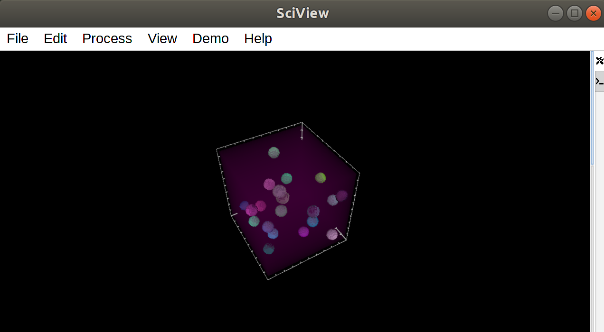

# Testing instructions for workshop

1. Install sciview into Fiji following [these instructions](https://docs.scenery.graphics/sciview/installation/installing-the-sciview-plugin-for-fiji).

2. Follow the instructions up to the point of launching sciview

3. In sciview, select the menu: Demos > Show segmentation

4. If you see a 3D volume with some colored blobs (like in the image below), then sciview is working for you. Congratulations!

###

Contact Kyle Harrington or Ulrik Guenther if you have specific questions.
